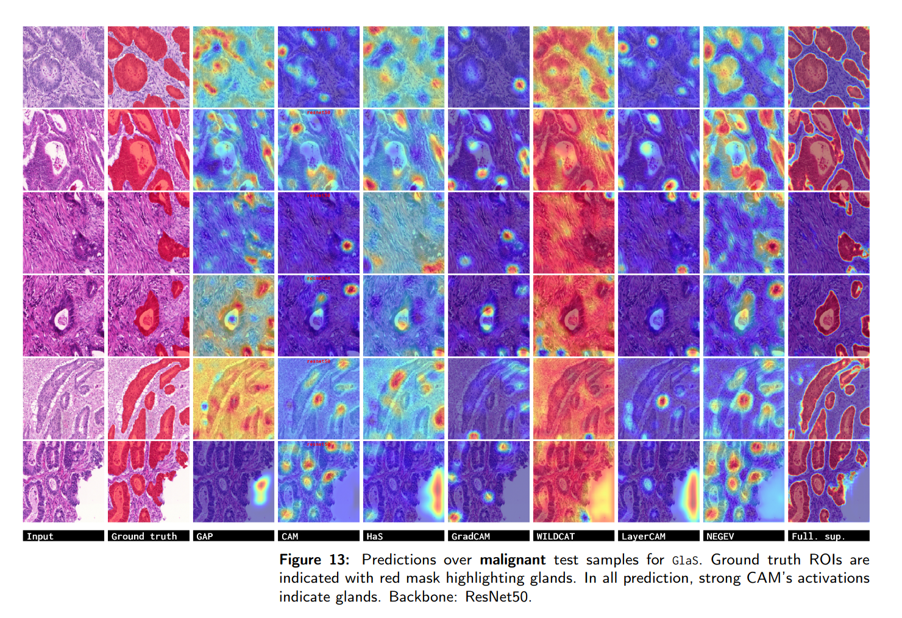

# [PixelCAM: Pixel Class Activation Mapping for Histology Image Classification and ROI Localization]
by **Alexis Guichemerre<sup>1</sup>, Soufiane Belharbi<sup>1</sup>, mohammadhadi.shater<sup>1</sup>, Luke McCaffrey<sup>4</sup>, Eric Granger<sup>1</sup>**
<br/>
<sup>1</sup> LIVIA, ILLS, Dept. of Systems Engineering, ÉTS, Montreal, Canada
<br/>
<sup>4</sup> Goodman Cancer Research Centre, Dept. of Oncology, McGill University, Montreal, Canada

## Abstract

Weakly supervised object localization (WSOL) allows to classify an image and localize ROIs. WSOL only require low-cost annotation, yet provides an interpretable classifier which is critical in histology image analysis. Standard WSOL methods rely on Class Activation Mapping (CAM) methods to produce spatial localization maps according to a single- or two-step strategy. While both strategies have led to significant progress, they still face several limitations with histology images. Single-step methods can easily result in under- or over-activation due to the inherent challenges of histology images and the lack of localization cues, while also facing the well-known issue of asynchronous convergence between the two tasks. The two-step approach is sub-optimal because it is tied to a frozen classifier, limiting the capacity for localization. Moreover, these methods tend to break down when applied to out-of-distribution (OOD) datasets.In this paper, a novel multi-task approach for WSOL is introduced for simultaneous training of both tasks, classification and localization. In particular, we consider performing localization in the pixel-feature space of an image encoder that is shared for classification. This allows learning discriminant features and accurate delineation of foreground/background regions to support ROI localization and image classification. To this end, we propose \pixelcam, a cost-effective foreground/background pixel-wise classifier in the pixel-feature space allowing spatial object localization. Using partial-cross entropy, PixelCAM is trained using pixel pseudo-labels collected from a pretrained WSOL model. Both image and pixel-wise classifiers are trained simultaneously using standard gradient descent. Our extensive experimentson GlaS and CAMELYON16 cancer datasets show that \pixelcam can significantly improve classification and localization performance when integrated with different WSOL methods. Most importantly, it provides robustness on both tasks for OOD problems linked to different cancer types, with large domain shifts between training and testing image data.

### Issues:
Please create a github issue.

### Content:
* [View](#view)
* [Requirements](#re2q)
* [Datasets](#datasets)
* [Run code](#run)


#### <a name='view'> Method</a>:
<!--  -->


Implemented WSOL methods:
- GAP
- Max-Pooling
- LSE
- CAM
- HaS
- WILDCAT
- ACoL
- SPG
- Deep MIL
- PRM
- ADL
- CutMix
- TS-CAM
- MAXMIN  -- Please use the original implementation https://github.com/sbelharbi/deep-wsl-histo-min-max-uncertainty
- NEGEV
- GradCAM
- GradCAM++
- Smooth-GradCAM++
- LayerCAM
- U-Net


<!-- 
#### <a name='results'> Results</a>:





 -->


#### <a name='reqs'> Requirements</a>:

Quick installation to create a virtual environment using conda:
```bash
./make_venv.sh NAME_OF_YOUR_VENV
```

* [Full dependencies](dependencies/requirements.txt)
* Build and install CRF:
    * Install [Swig](http://www.swig.org/index.php)
    * CRF (not used in this work, but it is part of the code.)

```shell
cdir=$(pwd)
cd dlib/crf/crfwrapper/bilateralfilter
swig -python -c++ bilateralfilter.i
python setup.py install
cd $cdir
cd dlib/crf/crfwrapper/colorbilateralfilter
swig -python -c++ colorbilateralfilter.i
python setup.py install
```

#### <a name="datasets"> Download datasets </a>:
#### 2.1. Links to dataset:
* [GlaS](https://warwick.ac.uk/fac/sci/dcs/research/tia/glascontest)
* [Camelyon16](https://github.com/jeromerony/survey_wsl_histology)


#### 2.2. Download datasets:

* GlaS: [./download-glas-dataset.sh](./download-glas-dataset.sh).

You find the splits in [./folds](./folds).


### 2.3 Code for datasets split/sampling (+ patches sampling from WSI):
* See [datasets-split](https://github.com/jeromerony/survey_wsl_histology/tree/init-branch/datasets-split).
* Detailed documentation: [datasets-split/README.md](https://github.com/jeromerony/survey_wsl_histology/blob/init-branch/datasets-split/README.md).

#### <a name="run"> Run code </a>:

E.g. PixelCAM method via CAM WSOL method.

1- Train on data GlaS:

* LayerCAM-method: LayerCAM over GlaS using ResNet50:
```shell
#!/usr/bin/env bash 
 
CONDA_BASE=$(conda info --base) 
source $CONDA_BASE/etc/profile.d/conda.sh
conda activate da

# ==============================================================================
cudaid=$1
export CUDA_VISIBLE_DEVICES=$cudaid

export OMP_NUM_THREADS=50
python main.py \
       --task STD_CL \
       --encoder_name resnet50 \
       --arch STDClassifier \
       --spatial_dropout 0.1 \
       --runmode search-mode \
       --opt__name_optimizer sgd \
       --batch_size 32 \
       --eval_batch_size 64 \
       --eval_checkpoint_type best_localization \
       --opt__step_size 5 \
       --opt__gamma 0.1 \
       --max_epochs 20 \
       --freeze_cl False \
       --support_background True \
       --method LayerCAM \
       --spatial_pooling WGAP \
       --dataset GLAS \
       --fold 0 \
       --cudaid $cudaid \
       --debug_subfolder None \
       --amp True \
       --opt__lr 0.001 \
       --sf_uda False \
       --exp_id 01_12_2024_09_23_52_900932__4871059
```

From the folder of the experiment `01_02_2024_09_23_52_900932__4871059`, 
copy one of the checkpoints folders to the folder `pretrained` 
`GlaS-0-resnet50-LayerCAM-WGAP-cp_best_localization` or 
`GlaS-0-resnet50-LayerCAM-WGAP-cp_best_classification`.

Store the CAMs of the training dataset in the folder data_cams

2- Train PixelCAM on data GlaS: 

```shell
#!/usr/bin/env bash 
 
CONDA_BASE=$(conda info --base) 
source $CONDA_BASE/etc/profile.d/conda.sh
conda activate da

# ==============================================================================
cudaid=$1
export CUDA_VISIBLE_DEVICES=$cudaid

export OMP_NUM_THREADS=50
python main.py \
       --task STD_CL \
       --encoder_name resnet50 \
       --arch STDClassifier \
       --spatial_dropout 0.1 \
       --runmode search-mode \
       --opt__name_optimizer sgd \
       --batch_size 32 \
       --eval_batch_size 64 \
       --eval_checkpoint_type best_localization \
       --opt__step_size 5 \
       --opt__gamma 0.1 \
       --max_epochs 1000 \
       --freeze_cl False \
       --support_background True \
       --method PixelCAM \
       --spatial_pooling WGAP \
       --dataset GLAS \
       --fold 0 \
       --cudaid $cudaid \
       --debug_subfolder None \
       --amp True \
       --opt__lr 0.001 \
       --ece True \
       --ece_lambda 1.0 \
       --neg_samples_partial False \
       --sl_pc_seeder probability_negative_salloarea_seeder \
       --sl_min 5 \
       --sl_max 5 \
       --sl_min_p 0.4 \
       --path_cam  resnet50-layercam-bloc-glas \
       --path_pre_trained_model_cl GLAS-0-resnet50-LayerCAM-WGAP-cp_best_classification \
       --exp_id 01_12_2024_09_25_14_467534__5485897
```
